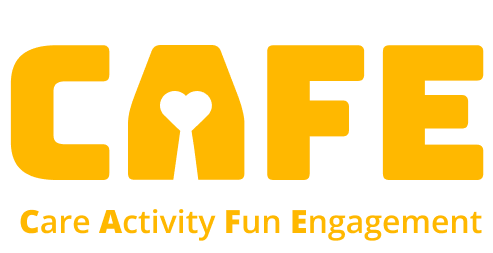
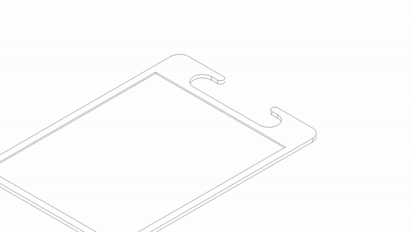
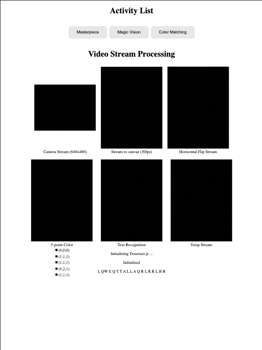

# CAFE System Prototype



## Description

This is the prototype of activities in CAFE System.

CAFE system is a University of Washington MSTI Launch project. The goal of this project is to develop a system that can help people with dementia to stay engaged and active through different interactive activities. The system will be able to track the user's activities and provide feedback to the caregivers.

In this prototype, we have three functional activities: Masterpiece (a tracing and drawing game), Color Matching (a short-term memory game and focus game), and Magic Vision (a OCR - text - AI-generated image and sharing game). The prototype is built with Node.js, React

## Getting Started

### Accessories

* 3D print camera reflector
* 3D print iPad holder (stand)
* laser cut base plate (0.25in bottom layer, 0.125in top layer)

The files for 3D printing and laser cutting are in the [prototype_assets](./prototype_assets) folder.

The assembly process is shown below:


### Depedencies

This project has no specified system dependencies for deployment. It can be deployed on GitHub Page or any other static hosting service.

### Installing

After cloning the repository. In the project directory, you can run to install all the dependencies:
```
npm install
```

### Executing program

For development locally, you can run:
```
npm start
```
and open [http://localhost:3000](http://localhost:3000) to view it in the browser.

The index page will be the testing page for checking whether each component are running correctly. 



You can click the buttons to test the activities.


## Authors 

[@Sven97](https://github.com/Sven97)

[@Cassie106](https://github.com/Cassie106)

## Version history

v0.1 Initial Release

## License

This project is licensed under the MIT License - see the LICENSE file for details

## Acknowledgments

### Team members

Angel Lin - [lin7fang@uw.edu](mailto:lin7fang@uw.edu)

Cassie Yin - [luy106@uw.edu](mailto:luy106@uw.edu)

Euphie Zhao - [yfzhao@uw.edu](mailto:yfzhao@uw.edu)

Xiaoyang Qiu - [xyqiu@uw.edu](mailto:xyqiu@uw.edu)

Yuxuan Wang - [wyunhan@uw.edu](mailto:wyunhan@uw.edu)

### Sponsor

Carolyn M. Parsey, PhD (Neuropsychologist and UW assistant professor of Neurology)

### Advisors

Linda Wagner (Teaching Associate Professor & Director of Academic Programs, GIX)

John Raiti (Teaching Assistant Professor & Technical Programs Advisor, GIX)

### Third party libraries

* [Node.js](https://nodejs.org/en/)
* [React](https://reactjs.org/)